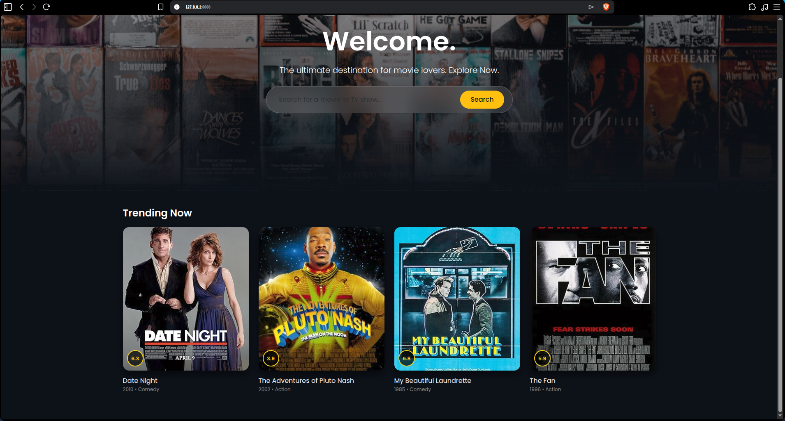
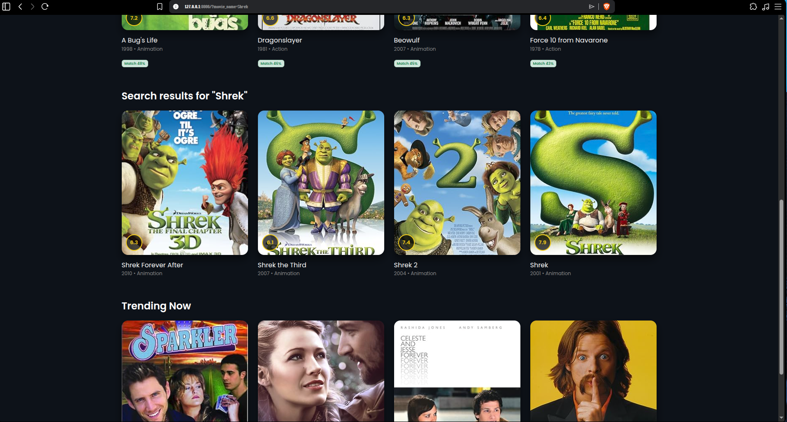
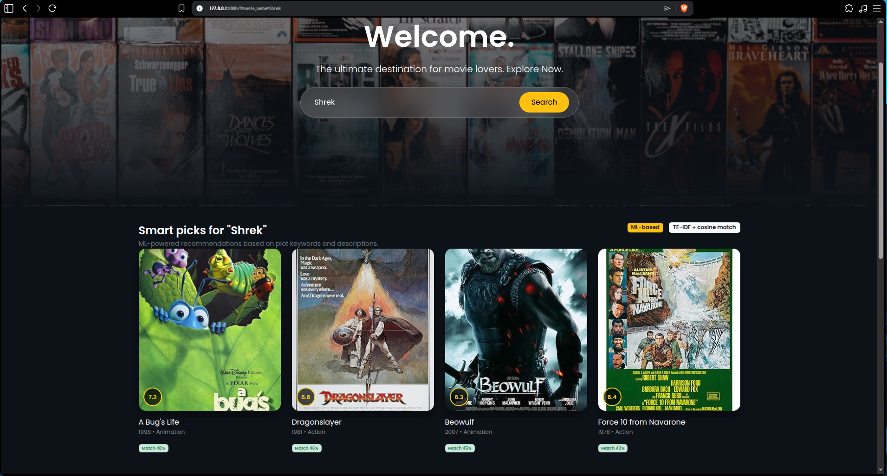

# Movie Recommender (Django + ML)



A Django web app that recommends similar movies from plot descriptions and enriches results with posters and metadata from OMDb. The UI supports search-driven recommendations and a trending carousel, backed by a TF-IDF + SVD + kNN model.

## Screenshots





## Features

- Search for a movie title and get similarity-ranked recommendations
- Trending titles sampled from the local dataset
- Poster, rating, year, and genre pulled from OMDb with in-process caching
- Lightweight ML stack using TF-IDF, optional Truncated SVD, and kNN

## Tech Stack

- Django 4.2+ (server + templates)
- pandas and scikit-learn (feature extraction + similarity)
- requests (OMDb API)
- SQLite (default Django database for local dev)

## ML Approach

The recommendation engine builds a TF-IDF matrix from movie descriptions. If the dataset is large enough, it reduces dimensionality using Truncated SVD and normalizes vectors. Similar items are retrieved using cosine distance via k-nearest neighbors. Artifacts are built offline and loaded at runtime.

## Dataset

The app expects a CSV at the project root named `movies.csv` with:

- `title`
- `description`

Two helper scripts are included:

- `download_data.py` downloads and reshapes the TMDB 5000 dataset
- `clean_data.py` cleans a raw CSV into `movies.csv`

## Project Structure

```
.
├── manage.py
├── requirements.txt
├── movies.csv
├── download_data.py
├── clean_data.py
├── mysite/                 # Django project settings
└── movie_engine/           # Django app
    ├── recommender.py      # TF-IDF + kNN logic
    ├── omdb.py             # OMDb client + cache
    ├── views.py            # Page controller
    ├── urls.py             # App routes
    └── templates/
        └── movie_engine/
            └── index.html  # UI
```

## Setup

### Prerequisites

- Python 3.8+ (3.10+ recommended)
- pip

### Install

```bash
python -m venv .venv
source .venv/bin/activate
pip install -r requirements.txt
```

### Download a Dataset

```bash
python download_data.py
```

If you already have a raw CSV, clean it instead:

```bash
python clean_data.py
```

### Run the App

```bash
python manage.py migrate
python manage.py runserver
```

Open http://127.0.0.1:8000 and search for a title.

### Build Recommender Artifacts

```bash
python manage.py build_recommender
```

This writes model artifacts to `movie_engine/artifacts/` for runtime loading.

## Configuration

Environment variables:

- `OMDB_API_KEY` (required): OMDb API key used for posters and metadata. Get a free key at https://www.omdbapi.com/apikey.aspx.

Local dev convenience:

- Create a `.env` file with `OMDB_API_KEY=...` (loaded via `python-dotenv`).

Dataset location:

- By default the app loads `movies.csv` from the project root.
- To use a different path, define `MOVIES_CSV_PATH` in `mysite/settings.py`.

## Troubleshooting

- CSV load error: ensure `movies.csv` exists and includes `title` and `description` columns. Re-run `download_data.py` or `clean_data.py` if needed.
- Raw file is not a CSV: if `movies_raw.csv` is an HTML page, re-download the dataset or use the `download_data.py` helper.
- OMDb rate limit or auth errors: set `OMDB_API_KEY` and try again after a short wait.
- Missing artifacts error: run `python manage.py build_recommender`.

## Notes

- Recommendations are based on text similarity, not collaborative filtering.
- The dataset and OMDb lookups are cached in memory for faster repeat requests.
- This repo is configured for local development (DEBUG is on, SQLite database).
